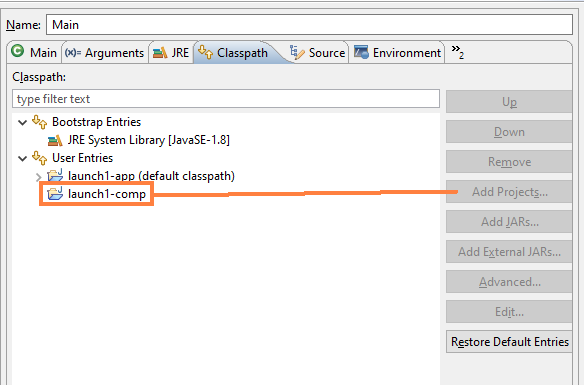

# launcher
Eclipse Launcher problem, Buildship/Gradle



I have added launch1-comp as a project to the launch configuration launch1-app/Main.launch. However Gson is not found when I start launch1-app. launch1-comp declares Gson
as a dependency.

## How to reproduce

- Clone repo into Eclipse
- run Main.launch

Output will be:

```
This is the app.
java.lang.NoClassDefFoundError: com/google/gson/Gson
```

Expectation: Gson should be on the classpath because I've added project launch1-comp to the launch configuration.
